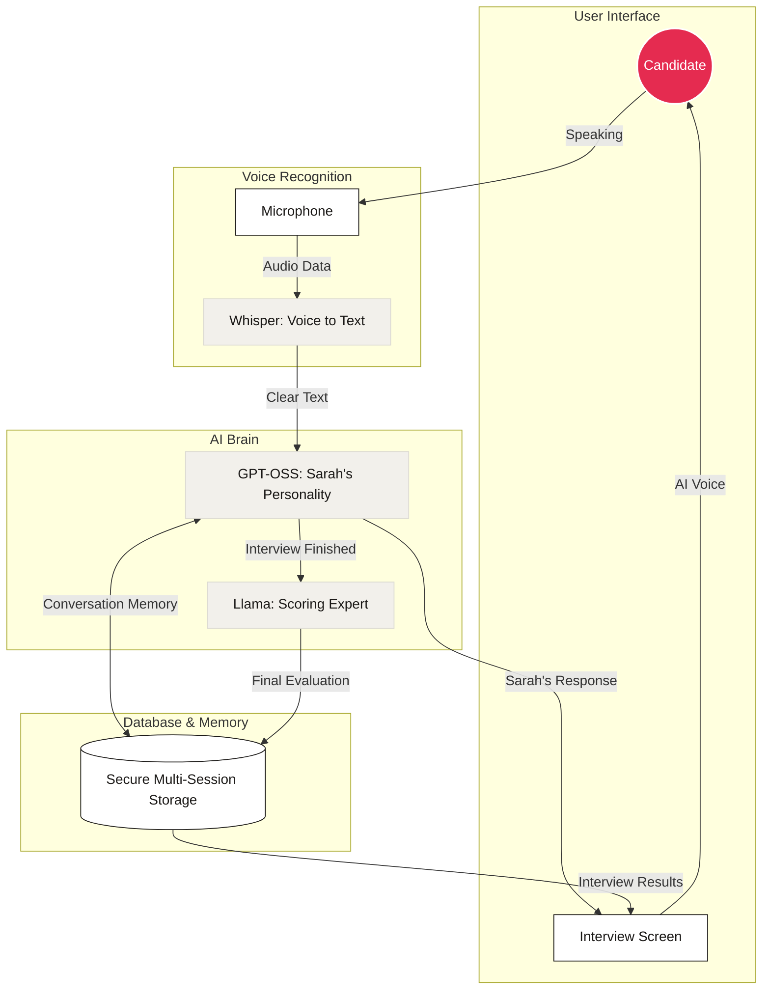

# Cuemath AI Tutor Screener
## Strategic Talent Evaluation via Generative Intelligence

> A production-grade, voice-first screening engine designed to evaluate tutor pedagogy, communication, and instructional warmth through high-fidelity adaptive conversation.

**[🚀 Live Demo](https://ai-tutor-screener-29ln.onrender.com/)**

> [!IMPORTANT]
> **Reviewer Notes:**
> - **Browser:** Use **Chrome or Edge** for the full voice experience (Web Speech live preview).
> - **Cold Start:** As this is on a free tier, please allow **30-60 seconds** for the first load to "wake up" the server.
> - **Data Persistence:** The demo uses a volatile SQLite database. Records are reset during redeploys—**please export reports to PDF** to save your results permanently.
> - **Assessments:** Reports take 5-15 seconds to generate in the background after the interview ends.

---

## What It Does

A candidate visits the interview page, enters their name, and has a **5–7 minute voice conversation** with **Sarah**, Cuemath's AI Interviewer. Sarah listens, adapts her questions based on what the candidate says, and produces a detailed assessment report at the end.

- 🎙️ **Voice-first** — speak naturally; Whisper transcribes accurately
- 🧠 **Fully adaptive** — no scripted question list; LLM decides what to ask next based on the conversation
- 📊 **Structured assessment** — scored across 5 dimensions with direct quotes as evidence
- 🏁 **End early** — candidate can end any time and still get a full report
- 📋 **Admin dashboard** — all sessions, scores, pass rates at a glance

---

## System Architecture & Flow



---

## Tech Stack

| Layer | Technology |
|---|---|
| **Backend** | FastAPI (Python 3.11) + SQLite (Stateless production architecture) |
| **Package Manager** | `uv` |
| **Conversation LLM** | `openai/gpt-oss-120b` via Groq (Optimized for latent voice personality) |
| **Assessment LLM** | `llama-3.3-70b-versatile` via Groq (High-rigor reasoning & scoring) |
| **Voice Transcription** | Groq Whisper `whisper-large-v3-turbo` (Prompt-guided context) |
| **Live Preview STT** | Web Speech API (Chrome/Edge parallel track) |
| **Frontend** | Modular ES6 Modules + Vanilla CSS (Editorial Parchment Theme) |
| **Deployment** | Render.com (Optimized for stateless horizontal scaling) |

---

## Assessment Dimensions

| Dimension | What It Measures |
|---|---|
| **Communication Clarity** | Clear, structured, easy to follow |
| **Warmth & Patience** | Genuine care and empathy for students |
| **Ability to Simplify** | Child-friendly analogies and explanations |
| **English Fluency** | Natural, grammatically correct speech |
| **Candidate Fit** | Overall suitability for Cuemath tutoring |

Each dimension gets a score (1–10), a one-sentence justification, and a **direct quote** from the transcript as evidence.

**Recommendation:** `Move to next round` / `Consider with reservations` / `Do not move forward`

---

## Project Structure

```
ai-tutor-screener/
├── backend/
│   ├── main.py           # FastAPI routes + /api/transcribe (Whisper) + serves frontend
│   ├── conversation.py   # Dynamic InterviewEngine — LLM-driven, dimension-tracking
│   ├── assessment.py     # Structured assessment generator with transcript cleaning
│   ├── database.py       # SQLite operations (sessions, messages, assessments)
│   ├── prompts.py        # All LLM prompts (no hardcoded questions)
│   ├── config.py         # Environment config
│   └── .env.example      # Template for environment variables (API keys, models)
├── frontend/
│   ├── index.html        # Interview page (progress ring, dual timer, mic UI)
│   ├── report.html       # Assessment report (print-ready PDF)
│   ├── dashboard.html    # Admin dashboard (auto-refreshes every 30s)
│   ├── style.css         # Design system (Editorial Parchment + Dark mode config)
│   └── js/               # ES6 Modular Frontend
│       ├── api.js        # Backend fetch calls
│       ├── audio.js      # Whisper MediaRecorder + Chrome GC TTS patch
│       ├── main.js       # Core interview orchestrator
│       ├── theme.js      # Persistent OS-override theme toggle
│       └── ui.js         # DOM manipulation & typing animations
├── render.yaml           # One-click Render deployment config
└── pyproject.toml        # uv project config (Python 3.11)
```

---

## Local Setup

### Prerequisites
- Python 3.11+
- [`uv`](https://docs.astral.sh/uv/) — fast Python package manager
- A free [Groq API key](https://console.groq.com)

### 1. Install dependencies

```bash
uv sync
```

### 2. Configure environment

```bash
cp backend/.env.example backend/.env
```

Edit `backend/.env`:

```env
GROQ_API_KEY=your_groq_api_key_here

# All three models are served via Groq — one API key handles everything
CONVERSATION_MODEL=openai/gpt-oss-120b
ASSESSMENT_MODEL=llama-3.3-70b-versatile
WHISPER_MODEL=whisper-large-v3-turbo

DATABASE_URL=./screener.db
```

### 3. Run

```bash
cd backend
uv run uvicorn main:app --reload
```

Open **http://localhost:8000** in Chrome or Edge.

---

## Deployment (Render.com — Free)

1. Push to GitHub
2. Sign up at [render.com](https://render.com) — no credit card needed
3. **New Web Service** → connect your repo
4. Root directory: `.` (leave empty or default)
5. Build command: `pip install uv && uv sync`
6. Start command: `cd backend && uv run uvicorn main:app --host 0.0.0.0 --port $PORT`
7. Add environment variable: `GROQ_API_KEY=your_key`
8. Deploy ✅

> The `render.yaml` in the repo handles all of this automatically via Infrastructure as Code.

---

## Key Design Decisions

### No hardcoded question list
Instead of a fixed list like "Q1: tell me about yourself, Q2: explain fractions...", the LLM receives:
- Full conversation history
- List of uncovered assessment dimensions
- What the candidate just said

It then decides **what to ask next** and **how to phrase it** based on the candidate's actual context (their background, analogies they used, experiences they mentioned).

### Dual-track voice recording
Two things run in parallel when you click the mic:
1. **MediaRecorder** — captures raw audio → sent to Groq Whisper for accurate transcription
2. **Web Speech API** — provides live preview text in the input box

Whisper result takes precedence. Web Speech text is the fallback if transcription fails.

### Production Grade Architecture
- **FastAPI Static Mounting:** Uses FastAPI's `StaticFiles` capability to "mount" and serve the entire frontend as a static directory from the root URL. This unified architecture ensures zero CORS errors, simplifies deployment on Render's free tier, and results in a highly efficient, single-unit codebase.
- **Stateless Database Backend:** The system utilizes a worker-safe SQLite persistence layer rather than volatile in-memory caches, enabling horizontal worker scaling and instant session recovery on disconnects.
- **Context Token Optimization:** Conversational routing paths are strictly injected natively as `system` messages mapping the candidate's exact turn history and runtime constraints, protecting against temporal persona-drift.
- **Garbage Collection Immunity:** Implemented global state tracking to prevent Chrome's aggressive garbage collection from terminating long `SpeechSynthesisUtterance` queries mid-sentence.
- **Modular Isolation:** The frontend separates state layers (`api.js`, `audio.js`, `ui.js`) to ensure UI and Media tracking do not mutually lock each other up.

### Zero-Framework "Vanilla" Frontend
The frontend is intentionally built using **Pure Vanilla JS** and **Vanilla CSS** instead of frameworks like **Next.js**, **React**. 
- **Lightning Performance:** Instant page loads and zero "Hydration" delay because the browser doesn't have to download and execute large JavaScript bundles typical of **Next.js** applications.
- **Free-Tier Optimized:** By avoiding a complex Node.js build step (like `next build`), the project stays extremely lightweight—critical for high reliability and fast cold-starts on Render.com's free tier.
- **Sustainability:** Uses native ES6 modules and CSS variables, ensuring the codebase is easy to maintain and future-proof without the version-locked dependencies often found in framework ecosystems.

### Assessment transcript cleaning & Integrity
Before sending to the assessment LLM, the transcript is cleaned:
- `[Candidate chose to end interview early]` markers removed
- Repeat requests (`"can you repeat that?"`) filtered out
- **Zero-Data Guardrail:** If the transcript contains no substantive candidate response, the system triggers an automatic fail without calling the LLM to prevent hallucinations.
- **Data Sufficiency Check:** Minimum word count and turn-count checks ensure the LLM has evidence before scoring.

---

## Edge Cases Handled

| Situation | How It's Handled |
|---|---|
| "Can you repeat that?" | Sarah warmly repeats the last question exactly |
| "I don't know" (repeated) | After 2 in a row, Sarah moves on gracefully without pressure |
| Candidate ends early | Immediate wrap-up + report generated from partial interview |
| Very short answer (< 12 words) | Classified as `short` → follow-up question triggered |
| Whisper transcription fails | Falls back to Web Speech accumulated text |
| Server restart mid-session | Engine state rebuilt from DB on reconnect (Session Persistence) |
| Non-Chrome browser | Warning banner shown; text input always available as fallback |
| Interview has no data | **Hard-Fail Guardrail** → No hallucinated reports; score set to 0.0 |
| PDF Export in Dark Mode | High-contrast Print Media overrides ensure black text on white paper |

---

*Built and documented with the strategic help of **Google Antigravity** and **Claude AI**.*


